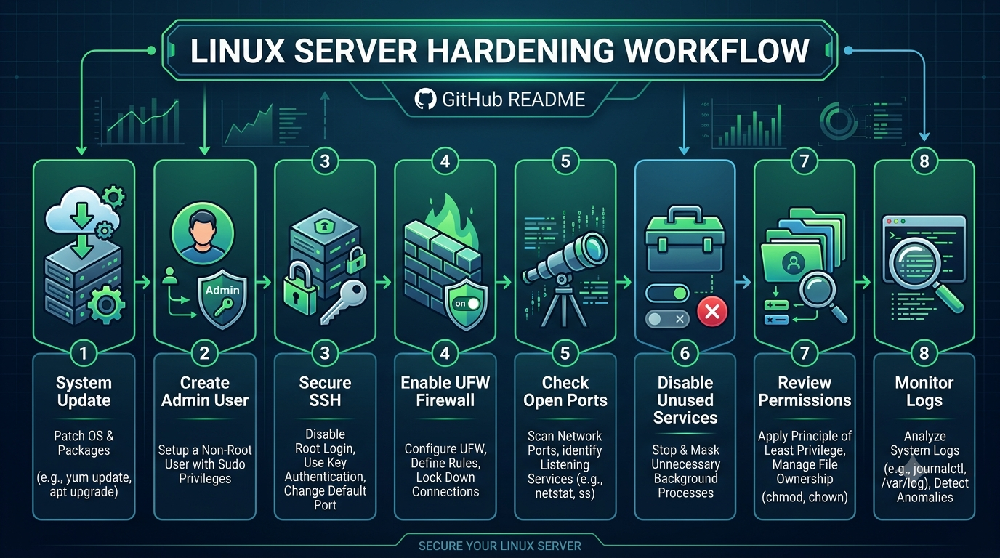
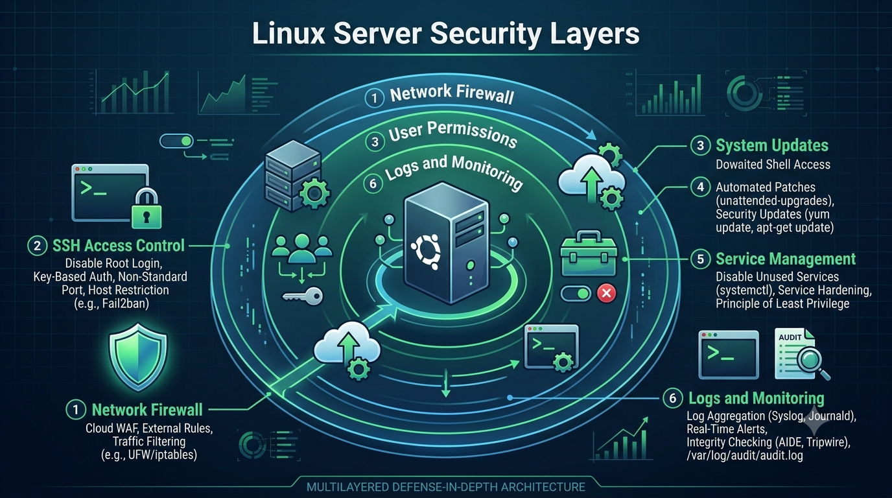
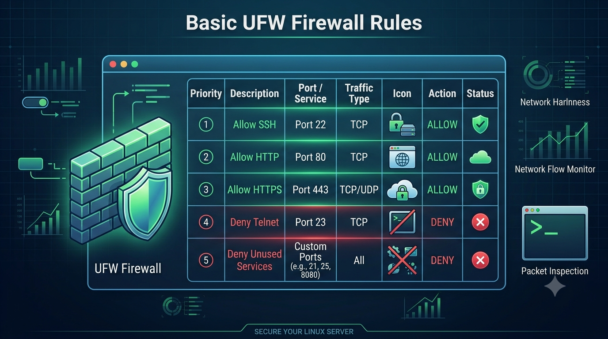
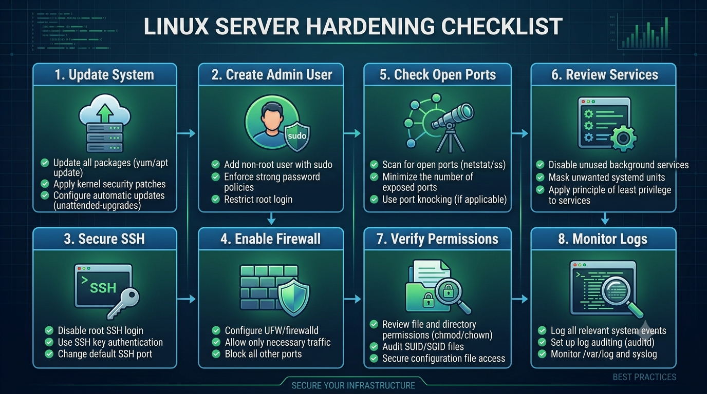
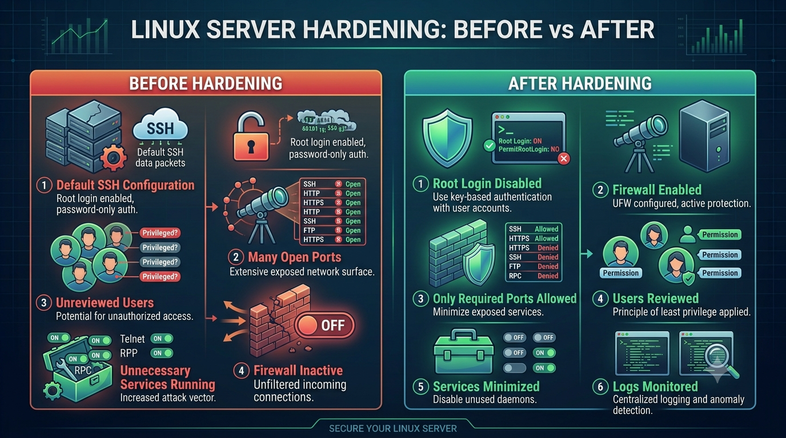

# Linux Server Hardening Lab

## Project Overview
This project presents a basic Linux server hardening lab focused on improving the security of an Ubuntu server.

The goal is to apply essential security practices such as user management, SSH hardening, firewall configuration, system updates, and basic service protection.

## Objectives
- Understand basic Linux server security concepts
- Apply initial hardening steps on an Ubuntu server
- Secure SSH access
- Configure a basic firewall using UFW
- Manage users and permissions
- Document practical system administration steps

## Environment
- Ubuntu Server
- Terminal / Command Line
- UFW Firewall
- SSH Service
- Linux users and permissions

## Main Topics Covered
- System updates
- User account management
- SSH security
- Firewall configuration
- Service management
- File permissions
- Security checklist

## Repository Structure
- `README.md` → Main project presentation
- `docs/theory.md` → Theoretical concepts
- `docs/practical-steps.md` → Practical hardening steps
- `docs/commands.md` → Useful Linux commands
- `docs/checklist.md` → Security hardening checklist
- `docs/notes.md` → Notes and lessons learned

## Key Learning Outcomes
- Improved understanding of Linux server security
- Practical experience with SSH and firewall configuration
- Better knowledge of users, groups, and permissions
- Ability to document a technical security process

## Important Note
This project is a lab environment for learning purposes. No sensitive or production information is included.

## Visual Documentation

### Linux Server Hardening Workflow

### Linux Server Security Layers

### Basic UFW Firewall Rules

### Linux Server Hardening Checklist

### Before vs After Hardening

